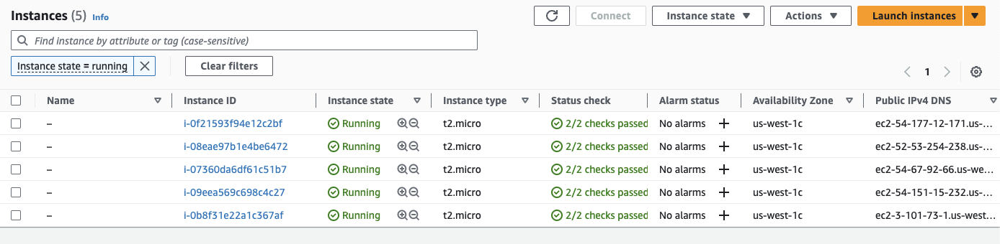

# Example 1 
This will be my demonstration of using Terraform IaC to push 5 instances 
all written as separate resources, and refactoring the code until matching 
what is already deployed in AWS.

This folder will be linked to Issue #12 in GitHub projects. Can be found here:

`/Ex1/main.tf`


## Steps

1. Create an `aws_launch_configuration` resource.
- be sure to use `image_id` instead of `ami` because the `aws_launch_configuration requires a different`
- note the `create_before_destroy` **lifecycle setting**, which causes Terraform to *create the resource first* (and updating references) then deleting the old resource.

```
resource "aws_launch_configuration" "web_server_asg" {
  image_id        = "ami-0f8e81a3da6e2510a"
  instance_type   = "t2.micro"
  security_groups = [aws_security_group.instance.id]

  user_data = <<-EOF
              #!/bin/bash
              echo "Hello, World" > index.html
              nohup busybox httpd -f -p ${var.server_port} &
              EOF

  # Required when using a launch configuration with an ASG
  lifecycle {
    create_before_destroy = true
  }
}
```

2. Create the `aws_autoscaling_group` resource.
- each of the 2-10 instances will be tagged with the name `terraform-asg-example`
- an **ASG** uses a *reference* to fill in the launch configuration name, but since the ASG references the *old* resource, Terraform will *not* delete it.
- `health_check_type = "ELB"` is used because it instructs ASG to use target groups' health check to determine if an instance is healthy and will automatically replace the instance if the target group reports unhealthy. 

```
resource "aws_autoscaling_group" "web_server_asg" {
  launch_configuration = aws_launch_configuration.web_server_asg.name
  vpc_zone_identifier = data.aws_subnets.default.ids

  # point at new target group
  target_group_arns = [aws_lb_target_group.asg.arn]
  health_check_type = "ELB"

  min_size = 2
  max_size = 10

  tag {
    key                 = "Name"
    value               = "terraform-asg-example"
    propagate_at_launch = true
  }
}

```

3. Get data source for **vpc subnets**
- using `default = true` instructs Terraform to look up default VPC in my AWS account

```
data "aws_vpc" "default" {
  default = true
}
```

4. Combine with `aws_subnets` to get the subnets within the (default) VPC.
```
data "aws_subnets" "default" {
  filter{
    name = "vpc-id"
    values = [data.aws_vpc.default.id]
  }
}
```

5. Distribute traffic across servers using a **load balancer**, speficically the **Application Load Balancer (ALB)** by creating the `aws_lb` resource. ALB is best used for load balancing of HTTP and HTTPS traffic.
- Since there are no *extreme* performance requirements, ALB will be the best fit for my use case.
- ALB's are made of a **listener** which listens on a specific port (80) and protocol (HTTP), a **listener rule**, which takes requests that come into a listener and sends those that match the specific *paths* or hostnames* to specific **target groups**. **Target Groups** are one oor more servers that receive requests from the load balancer, and also performs health checks on these servers and sends requests to *only* healthy nodes.

```
resource "aws_lb" "example" {
  name = "terraform-asg-example"
  load_balancer-type = "application"
  subnets = data.aws_subnets.default.ids
}
```

6. Define a **listener** for this ALB using the `aws_lb_listener` resource:
- the **listener** configures the ALB to listen on the default HTTP port, port 80, use HTTP as the protocol, and then sends a simple 404 message if there are no matches to the **listener** rules.
- Any **resource** does not allow incoming or outgoing traffic, so I need to create a new security group just for the ALB.
- Allowing incoming requests on port 80 to access the ALB, and allow *outgoing* requests on all ports to perform health checks.

```
resource "aws_security_group" "alb" {
  name = "terraform-example-alb"

  # allow INbound HTTP requests
  ingress {
    from_port = 80
    to_port = 80
    protocol = "tcp"
    cidr_blocks = ["0.0.0.0/0"]
  }

  # allow ALL OUTbound requests
  egress {
    from_port = 0
    to_port = 0
    protocol = "-1"
    cidr_blocks = ["0.0.0.0/0"]
  }
}
```

7. Create a **target group** for the ASG using the `aws_lb_target_group` resource
- The health check occurs by sending an HTTP request to each instance. If there is no response, then it is considered 'unhealthy' and the target group will stop sending traffic to it to minimize disruption to users.


```
resource "aws_lb_target_group" "asg" {
  name = "terraform-asg-example"
  port = var.server_port
  protocol = "HTTP"
  vpc_id = data.aws_vpc.default.id

  health_check {
    path = "/"
    protocol = "HTTP"
    matcher = "200"
    interval = 15
    timeout = 3
    healthy_threshold = 2
    unhealthy_threshold = 2
  }
}
```

8. Create **listener rules** with the `aws_lb_listener_rule` resource.
- Adds a listener rule that sends requests that match any path to the target group containing the ASG.

```
resource "aws_lb_listener_rule" "asg" {
  listener_arn = aws_lb_listener.http.arn
  priority = 100

  condition {
    path_pattern {
      values = ["*"]
    }
  }

  action {
    type = "forward"
    target_group_arn = aws_lb_target_group.asg.arn
  }
}
```

9. Show an `output` that displays the **DNS name** *instead of the `public_ip`* from the original EC2 instance.
```
output "alb_dns_name" {
  value = aws_lb.web_server_asg.dns_name
  description = "The domain name of the load balancer"
}
```

10. Check what was created by entering this in the console: `curl http://<alb_dns_name>`


# Example 1 

## Ex1a Create 5 instances written as separate resources
Successfully completed, all using the same security group and key_pair



## Ex1b Refactor Using loops until it matches what is already deployed in AWS

